[](https://classroom.github.com/a/sR05ud-S)
# Homework 2

This assignment consists of two tasks. The detailed requirements of each task can be found in `hw2.pdf`.

Please fill in the blanks inside the "YOUR IMPLEMENTATION HERE" comments, any changes outside the area might be **ignored**.

## Getting Started

Since we are using PyTorch for `hw2`, we recommend using conda to manage the environment. Please refer to the [miniconda](https://docs.conda.io/en/latest/miniconda.html) or [miniforge](https://github.com/conda-forge/miniforge) homepage for a compact conda (or mamba) installation.

You have two options for creating the environment of hw2. For users without a CUDA device, please remove the `pytorch-cuda` term either way for a CPU-only installation.
* To create a new conda environment, simply run `conda env create -f environment.yml`
* If you want to install the package within the environment you created with `hw1`, please follow the below steps:

  ```bash
  conda activate <hw1-env-name>
  # remove the pytorch-cuda=12.1 term if you want a cpu-only installation
  conda install pytorch==2.2.1 pytorch-cuda=12.1 -c pytorch -c nvidia
  pip install gymnasium[classic_control]==0.29.1
  pip install matplotlib
  # for hyperparameter management
  pip install hydra-core==1.3.2
  # for video recording
  pip install moviepy==1.0.3
  # for attribute-like config access
  pip install dotmap
  # for tabular output of `test_main`
  pip install tabulate
  ```

That's it! If you encounter any trouble creating the environment, please let us know :-)


## Submitting the Results

After finishing your homework, please remember to commit the changes and push them to the GitHub repo.

TAs have created a GitHub workflow to evaluate your code automatically, and a reference score of your homework can be found on the Actions page of your repository. (The total points of the auto-test is 30, and 70 points are assigned to the report.)

You can also use the following command to quickly test your code locally.
```
python test_main.py
```
If your code is correct, you will see the following output:
```bash
Test Name                 Result    Score
------------------------  --------  -------
test_get_Q                Passed    10 pts
test_get_Q_target         Passed    5 pts
test_get_double_Q_target  Passed    5 pts
test_get_action           Passed    5 pts
test_dueling_forward      Passed    5 pts
------------------------  --------  -------
Total                     5/5       30 pts
```

However, the local test does not guarantee the final score you will get from the GitHub classroom. Please make sure your last commit can pass the GitHub workflow.

## NOTICE: DO NOT MODIFY AUTO-GRADING CODE!

The auto-grading relies on the contents within the `.github`, `test` folders, and the `test_main.py` file. These files should not be altered. You will not be able to modify your commit history as all changes are saved permanently in the GitHub classroom records.

Attempts to bypass the auto-grading system, either by altering grading scripts or creating functions intended to manipulate the test cases, will be recorded. Teaching assistants can easily verify any changes to these files.

Modifying auto-grading code or attempting to manipulate it will result in a zero mark for the assignment.

```bash
python main.py
python main.py agent.use_double=true
python main.py agent.use_dueling=true
python main.py buffer.use_per=true  
python main.py buffer.nstep=5
python main.py buffer.use_per=true buffer.nstep=5
python main.py buffer.use_per=true buffer.nstep=5 agent.use_dueling=true agent.use_double=true
```

# DRL-hw2：DQN

> 姓名：王子轩
>
> 学号：2023011307
>
> 邮箱：`wang-zx23@mails.tsinghua.edu.cn`

[TOC]

## 1 **Auto Grading Results**  (30pt)

| Github Action Page                                           | Local Test                                                   |
| ------------------------------------------------------------ | ------------------------------------------------------------ |
| 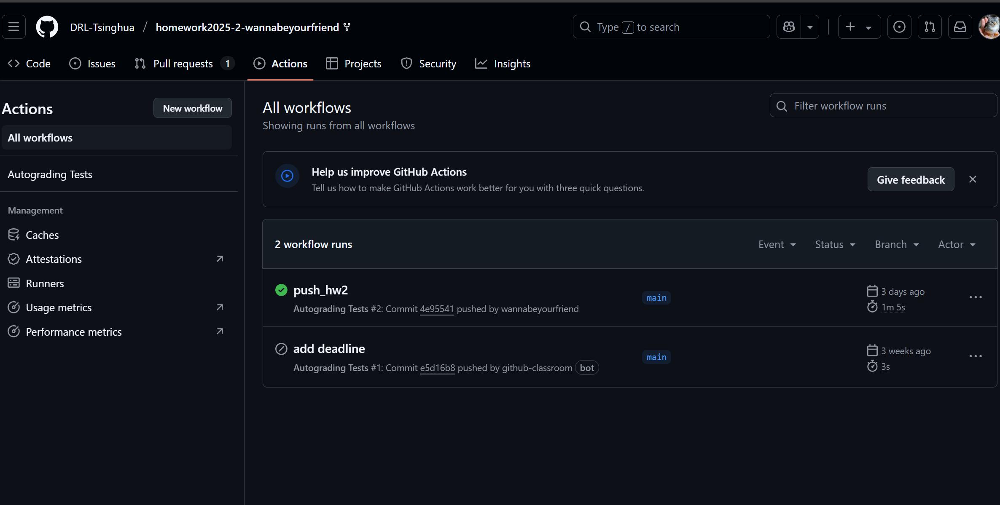 | 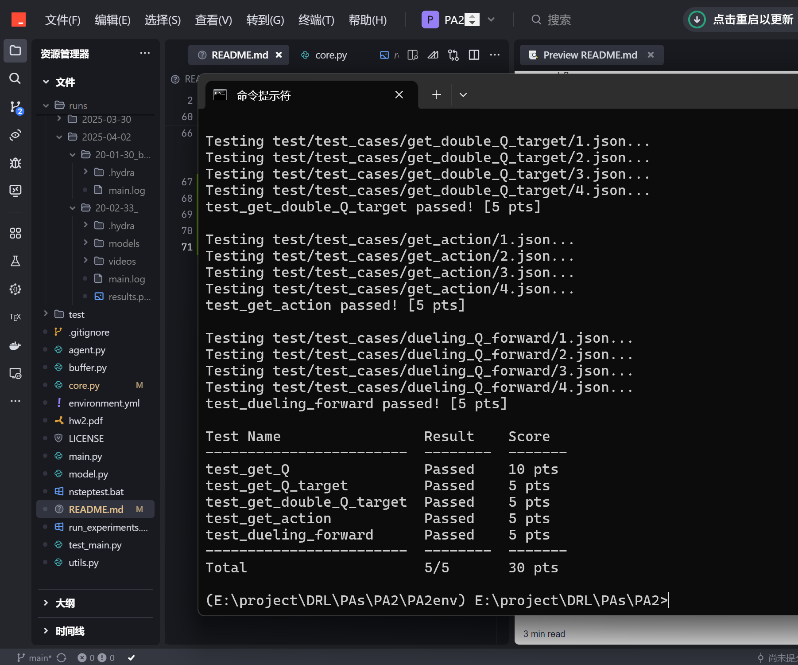 |

## 2 Main Labs (70=30+10+10+10+10pt)

### 2.1 **Normal DQN** (30pt)

#### Implemantion

##### DQNAgent

```python
@torch.no_grad()
def get_Q(self, state: torch.Tensor, action: torch.Tensor) -> torch.Tensor:
        ############################
        # YOUR IMPLEMENTATION HERE #
        q_values = self.q_net(state)
        Q = q_values.gather(1, action.unsqueeze(-1)).squeeze(-1)
        ############################
def get_action(self, state: np.ndarray) -> np.ndarray:
        """
        Get the optimal action according to the current Q value and state
        """

        ############################
        # YOUR IMPLEMENTATION HERE #
        state_tensor = torch.FloatTensor(state).to(self.device)
        q_values = self.q_net(state_tensor)
        
        if q_values.dim() == 1: 
            actions = torch.argmax(q_values).cpu().numpy()
        else:  
            actions = torch.argmax(q_values, dim=1).cpu().numpy()
        ############################
        return actions
def get_Q_target(self, reward: torch.Tensor, done: torch.Tensor, next_state: torch.Tensor) -> torch.Tensor:
        """
        Get the target Q value according to the Bellman equation
        """
        if self.use_double:
            ##########################
            # YOUR IMPLEMENTATION HERE
            pass
            ##########################
        else:
            ##########################
            # YOUR IMPLEMENTATION HERE
            next_q_values = self.target_net(next_state)
            next_q_value = torch.max(next_q_values, dim=1)[0]
            Q_target = reward + self.gamma * next_q_value * (1 - done)
            ##########################
        return Q_target
```

##### get_epsilon

```python
def get_epsilon(step, eps_min, eps_max, eps_steps, warmup_steps):
    """
    Return the linearly descending epsilon of the current step for the epsilon-greedy policy. 
    The value of epsilon will keep at eps_max before warmup_steps, and after eps_steps, it will keep at eps_min.
    """
    ############################
    # YOUR IMPLEMENTATION HERE #
    if step < warmup_steps:
        return eps_max
    elif step >= eps_steps:
        return eps_min
    else:
        progress = (step - warmup_steps) / (eps_steps - warmup_steps)
        return eps_max - progress * (eps_max - eps_min)
    ############################
```

#### Results

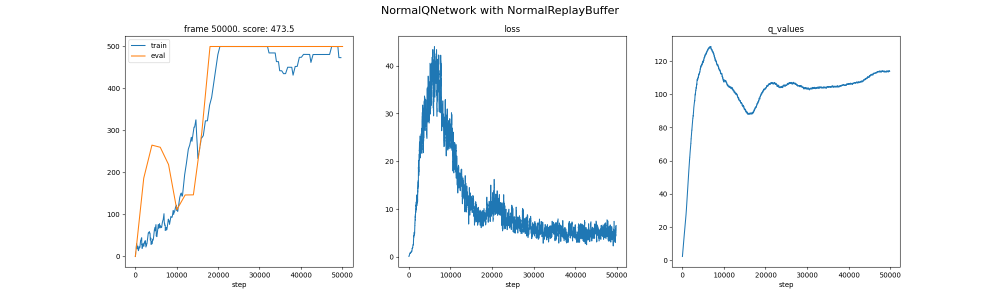

<video src="E:\project\DRL\PAs\PA2\runs\2025-04-02\20-02-33_\videos\dqn.mp4"></video>

### 2.2 **Double DQN** (10pt)

#### Implemention

##### DQNAgent

```python
@torch.no_grad()
    def get_Q_target(self, reward: torch.Tensor, done: torch.Tensor, next_state: torch.Tensor) -> torch.Tensor:
        """
        Get the target Q value according to the Bellman equation
        """
        if self.use_double:
            ##########################
            # YOUR IMPLEMENTATION HERE
            next_q_values = self.q_net(next_state)
            next_actions = torch.argmax(next_q_values, dim=1)
            next_q_values_target = self.target_net(next_state)
            next_q_value = next_q_values_target.gather(1, next_actions.unsqueeze(-1)).squeeze(-1)
            Q_target = reward + (1 - done) * self.gamma * next_q_value
            ##########################
        else:
            ##########################
            # YOUR IMPLEMENTATION HERE
            pass
            ##########################
        return Q_target
```

#### Results

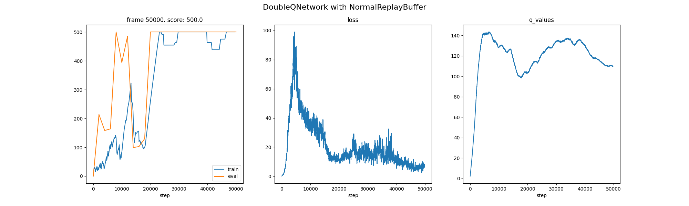

<video src="E:\project\DRL\PAs\PA2\runs\2025-04-02\20-17-31_agent.use_double=true\videos\doubledqn.mp4"></video>

### 2.3 **Dueling DQN** (10pt)

#### Implemetion

##### DuelingQNetwork

```python
def forward(self, state: torch.Tensor) -> torch.Tensor:
        """
        Get the Q value of the current state and action using dueling network
        """
        ############################
        # YOUR IMPLEMENTATION HERE #
        features = self.feature_layer(state)
        values = self.value_head(features)
        advantages = self.advantage_head(features)
        Qs = values + (advantages - advantages.mean(dim=-1, keepdim=True))
        ############################
        return Qs
```

#### Results

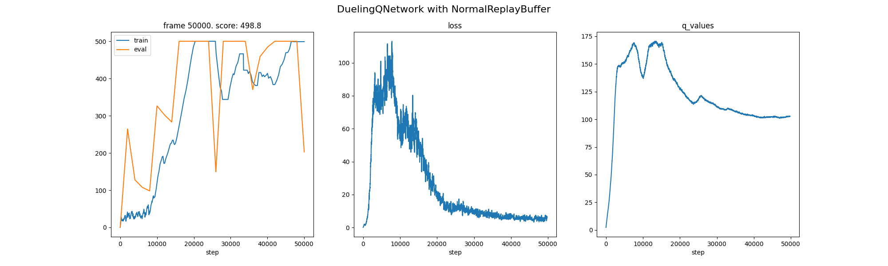

<video src="E:\project\DRL\PAs\PA2\runs\2025-04-02\20-23-54_agent.use_dueling=true\videos\dueldqn.mp4"></video>

### 2.4 **PER DQN** (10pt)

#### Implemention

##### PrioritizedReplayBuffer

```python
def sample(self, batch_size):
        # sample_idxs = self.tree.sample(batch_size)
        sample_idxs = self.rng.choice(self.capacity, batch_size, p=self.priorities / self.priorities.sum(), replace=True)
        
        # Get the importance sampling weights for the sampled batch using the prioity values
        # For stability reasons, we always normalize weights by max(w_i) so that they only scale the
        # update downwards, whenever importance sampling is used, all weights w_i were scaled so that max_i w_i = 1.
        
        ############################
        # YOUR IMPLEMENTATION HERE #
        probs = self.priorities[sample_idxs] / self.priorities.sum()
        # 计算重要性采样权重: (1/N * 1/P(i))^β
        weights = (1.0 / self.size / probs) ** self.beta
        weights = weights / weights.max()
        weights = torch.as_tensor(weights, dtype=torch.float32, device=self.device)
        ############################
        
        # Convert NumPy indices to PyTorch tensor using torch.tensor instead of torch.from_numpy
        sample_idxs_tensor = torch.tensor(sample_idxs, dtype=torch.long)
    
        batch = (
            self.states[sample_idxs_tensor].to(self.device, non_blocking=True),
            self.actions[sample_idxs_tensor].to(self.device, non_blocking=True),
            self.rewards[sample_idxs_tensor].to(self.device, non_blocking=True),
            self.next_states[sample_idxs_tensor].to(self.device, non_blocking=True),
            self.dones[sample_idxs_tensor].to(self.device, non_blocking=True)
        )
        return batch, weights, sample_idxs
```

#### Results

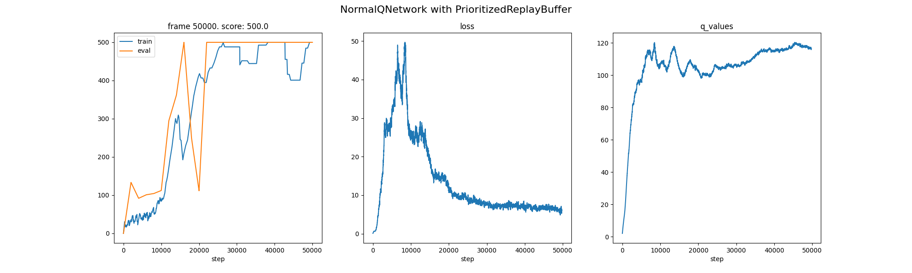

<video src="E:\project\DRL\PAs\PA2\runs\2025-04-02\20-30-13_buffer.use_per=true\videos\perdqn.mp4"></video>

### 2.5 **Nstep DQN** (10pt)

#### Implemention

##### NStepReplayBuffer 

```python
def n_step_handler(self):
        """Get n-step state, action, reward and done for the transition, discard those rewards after done=True"""
        ############################
        # YOUR IMPLEMENTATION HERE #
        state, action, _, _ = self.n_step_buffer[0]
        rewards = np.array([transition[2] for transition in self.n_step_buffer])
        dones = np.array([transition[3] for transition in self.n_step_buffer])
        discount_factors = np.power(self.gamma, np.arange(self.n_step))
        if np.any(dones):
            first_done_idx = np.argmax(dones)
            mask = np.zeros_like(rewards)
            mask[:first_done_idx + 1] = 1
            rewards = rewards * mask
            done = True
        else:
            done = False
        reward = np.sum(discount_factors * rewards)
        ############################
        return state, action, reward, done
```

#### Results  

##### N=5

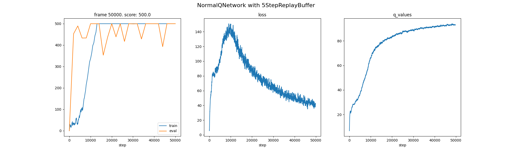

<video src="E:\project\DRL\PAs\PA2\runs\2025-04-02\20-40-11_buffer.nstep=5\videos\5stepdqn.mp4"></video>

##### N=10

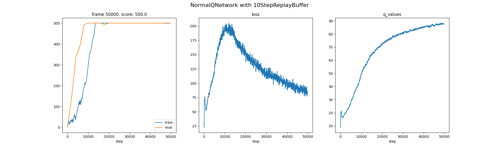

<video src="E:\project\DRL\PAs\PA2\runs\2025-03-30\20-07-04_buffer.nstep=10\videos\nstepdqn.mp4"></video>

##### N=30

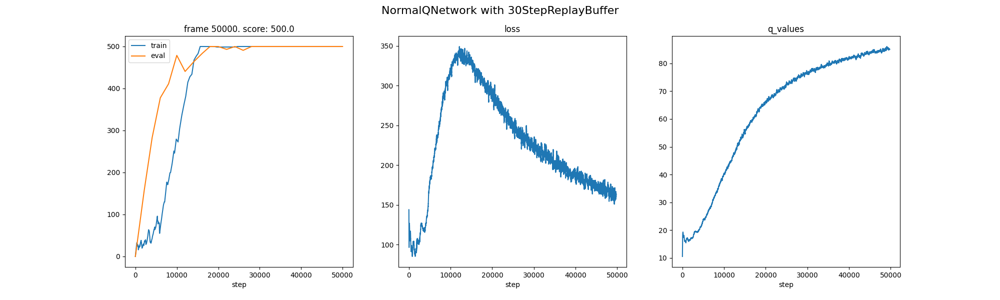

<video src="E:\project\DRL\PAs\PA2\runs\2025-03-30\20-13-31_buffer.nstep=30\videos\30stepdqn.mp4"></video>

## 3 Extention Labs (0pt)

### 3.1 **Nstep+PER DQN** (N=5)

#### Implemention

```python
# Avoid Diamond Inheritance
class PrioritizedNStepReplayBuffer():
    # Implement the PrioritizedNStepReplayBuffer class if you want to, this is OPTIONAL
    def __init__(self, capacity, eps, alpha, beta, n_step, gamma, state_size, seed, device):
        ############################
        # YOUR IMPLEMENTATION HERE #
        self.device = device
        self.rng = np.random.default_rng(seed)
        self.capacity = capacity
        self.size = 0
        self.idx = 0
        self.n_step = n_step
        self.gamma = gamma
        self.eps = eps
        self.alpha = alpha
        self.beta = beta
        self.max_priority = eps
        # Remove pin_memory calls
        self.states = torch.zeros(capacity, state_size, dtype=torch.float).contiguous()
        self.actions = torch.zeros(capacity, dtype=torch.long).contiguous()
        self.rewards = torch.zeros(capacity, dtype=torch.float).contiguous()
        self.next_states = torch.zeros(capacity, state_size, dtype=torch.float).contiguous()
        self.dones = torch.zeros(capacity, dtype=torch.int).contiguous()
        self.priorities = np.zeros(capacity, dtype=np.float32)
        self.n_step_buffer = deque([], maxlen=n_step)
        ############################
    def __repr__(self) -> str:
        return f'Prioritized{self.n_step}StepReplayBuffer'

    def add(self, transition):
        ############################
        # YOUR IMPLEMENTATION HERE #
        state, action, reward, next_state, done = transition
        self.n_step_buffer.append((state, action, reward, done))
        if len(self.n_step_buffer) < self.n_step:
            return
        state, action, reward, done = self.n_step_handler()
        self.states[self.idx] = torch.as_tensor(state)
        self.actions[self.idx] = torch.as_tensor(action)
        self.rewards[self.idx] = torch.as_tensor(reward)
        self.next_states[self.idx] = torch.as_tensor(next_state)
        self.dones[self.idx] = torch.as_tensor(done)
        self.priorities[self.idx] = self.max_priority
        self.idx = (self.idx + 1) % self.capacity
        self.size = min(self.capacity, self.size + 1)
        ############################

    def n_step_handler(self):
        state, action, _, _ = self.n_step_buffer[0]
        rewards = np.array([transition[2] for transition in self.n_step_buffer])
        dones = np.array([transition[3] for transition in self.n_step_buffer])
        discount_factors = np.power(self.gamma, np.arange(self.n_step))
        
        if np.any(dones):
            first_done_idx = np.argmax(dones)
            mask = np.zeros_like(rewards)
            mask[:first_done_idx + 1] = 1
            rewards = rewards * mask
            done = True
        else:
            done = False
            
        reward = np.sum(discount_factors * rewards)
        return state, action, reward, done
        
    def sample(self, batch_size):
        sample_idxs = self.rng.choice(self.capacity, batch_size, p=self.priorities / self.priorities.sum(), replace=True)
        probs = self.priorities[sample_idxs] / self.priorities.sum()
        weights = (1.0 / self.size / probs) ** self.beta
        weights = weights / weights.max()
        weights = torch.as_tensor(weights, dtype=torch.float32, device=self.device)
        
        # Convert NumPy indices to PyTorch tensor using torch.tensor
        sample_idxs_tensor = torch.tensor(sample_idxs, dtype=torch.long)
        
        batch = (
            self.states[sample_idxs_tensor].to(self.device, non_blocking=True),
            self.actions[sample_idxs_tensor].to(self.device, non_blocking=True),
            self.rewards[sample_idxs_tensor].to(self.device, non_blocking=True),
            self.next_states[sample_idxs_tensor].to(self.device, non_blocking=True),
            self.dones[sample_idxs_tensor].to(self.device, non_blocking=True)
        )
        return batch, weights, sample_idxs
        
    def update_priorities(self, data_idxs, priorities):
        if isinstance(priorities, list):
            priorities = np.array(priorities, dtype=np.float32)
        priorities = (priorities + self.eps) ** self.alpha
        self.priorities[data_idxs] = priorities
        self.max_priority = max(self.priorities)
```

#### Results

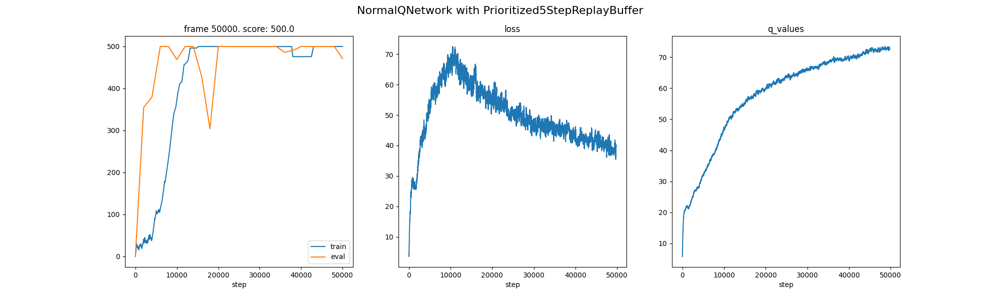

<video src="E:\project\DRL\PAs\PA2\runs\2025-04-02\20-55-22_buffer.nstep=5,buffer.use_per=true\videos\per5step.mp4"></video>

### 3.2 **Double+Duel+PER+Nstep DQN** (N=5)

#### Results

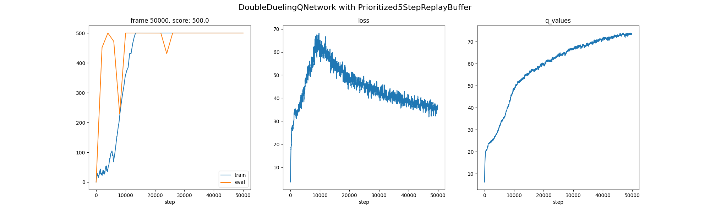

<video src="E:\project\DRL\PAs\PA2\runs\2025-04-02\21-04-21_agent.use_double=true,agent.use_dueling=true,buffer.nstep=5,buffer.use_per=true\videos\best_videos_seed_3407.mp4"></video>

