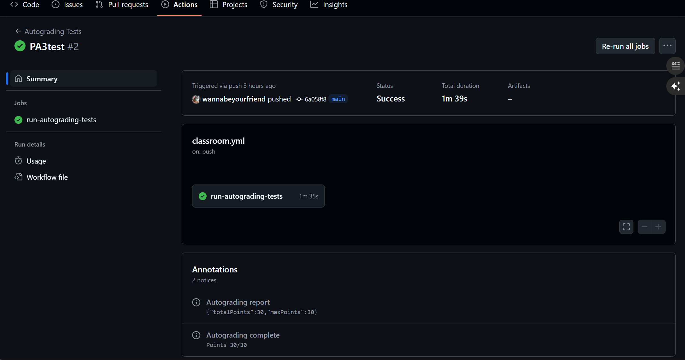
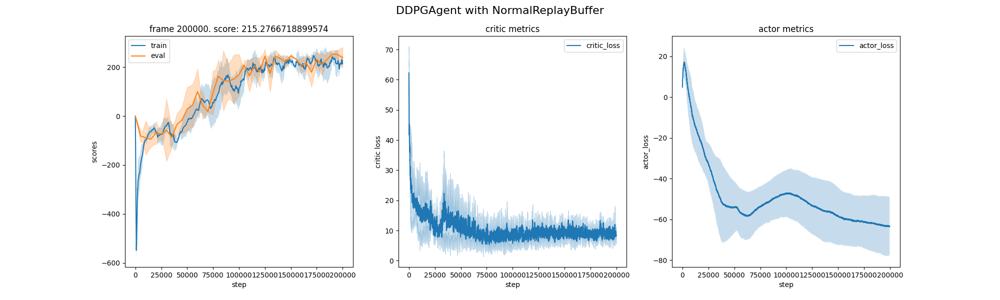
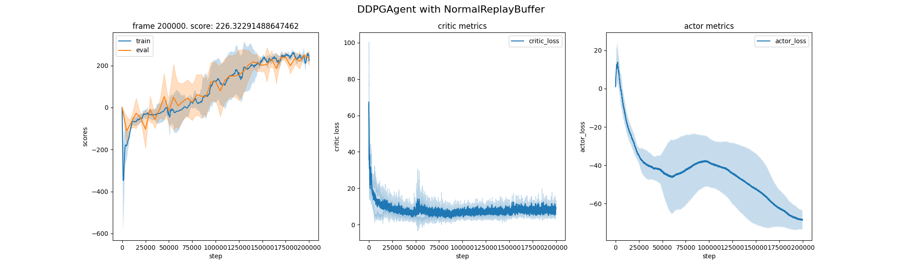
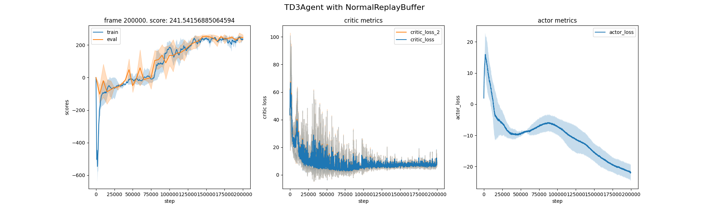
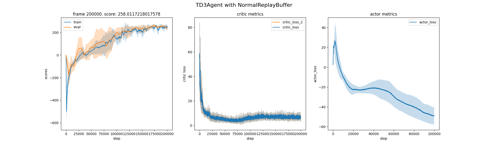
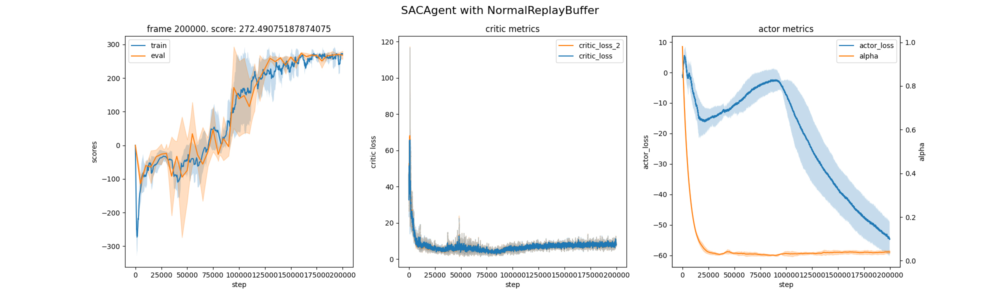
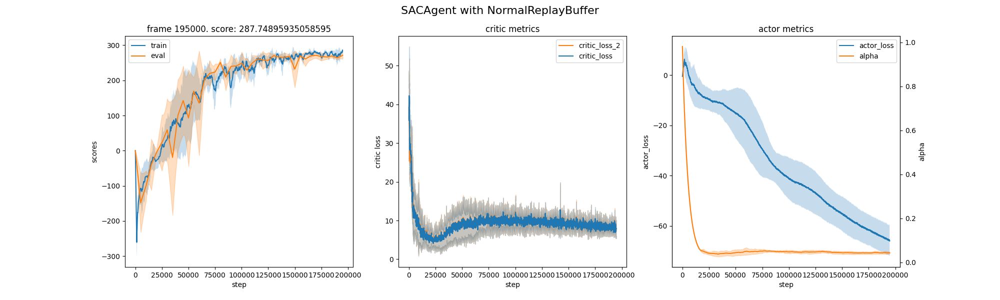

## Autograding Results

After finishing your homework, please remember to commit the changes and push them to the GitHub repo.

TAs have created a GitHub workflow to evaluate your code automatically, and a reference score of your homework can be found on the Actions page of your repository. (The total points of the auto-test is 30, and 70 points are assigned to the report.)

You can also use the following command to quickly test your code locally.

```
python test_main.py
```

If your code is correct, you will see the following output:

```bash
Test Name                 Result    Score
------------------------  --------  -------
test_get_Qs_ddpg          Passed    10 pts
test_get_actor_loss_ddpg  Passed    5 pts
test_get_Qs_td3           Passed    5 pts
test_get_alpha_loss_sac   Passed    5 pts
test_forward_sac          Passed    5 pts
------------------------  --------  -------
Total                     5/5       30 pts
```
Here is the result of the github workflow:

However, the local test does not guarantee the final score you will get from the GitHub classroom. Please make sure your last commit can pass the GitHub workflow.



## PA3 Policy Gradient Method: DDPG, TD3, SAC 

### DDPG

> `agent/ddpg.py`

```python
def get_Qs(self, 
            state: Float[Tensor, "batch_size state_dim"], 
            action: Float[Tensor, "batch_size action_dim"], 
            reward: Float[Tensor, "batch_size"], 
            next_state: Float[Tensor, "batch_size state_dim"], 
            done: Int[Tensor, "batch_size"]
        ) -> tuple[Float[Tensor, "batch_size"], Float[Tensor, "batch_size"]]:
        """
        Obtain the Q and target Q values from the agent's Q networks.
        Hint: this is the get_Q and get_Q_target method of Homework 2 combined.
        """
        ############################
        # YOUR IMPLEMENTATION HERE #
        Q = self.critic_net(state, action)
        with torch.no_grad():
            next_action = self.actor_target(next_state)
            next_Q = self.critic_target(next_state, next_action)
            Q_target = reward + self.gamma * next_Q * (1 - done.float())
        ############################
        return Q, Q_target
    
def get_actor_loss(self, 
            state: Float[Tensor, "batch_size state_dim"]
        ) -> Float[Tensor, ""]:
        """
        Obtain actor loss given state using the agent's Q and policy networks.
        """
        ############################
        # YOUR IMPLEMENTATION HERE #
        action = self.actor_net(state)
        actor_loss = -self.critic_net(state, action).mean()
        ############################
        return actor_loss
    
def get_action(self, 
            state: Float[np.ndarray, "state_dim"], 
            sample: bool = False
        ) -> Float[np.ndarray, "action_dim"]:
        """
        Use the policy network to obtain an action given the state.
        If sample, add noise to the action. The magnitude of the noise is determined by current epsilon.
        Hint: if you don't know what epsilon is, try looking for it in __init__
        Remember to clamp the action to the action_space's low and high values.
        """
        ############################
        # YOUR IMPLEMENTATION HERE #
        state_tensor = torch.as_tensor(state, dtype=torch.float32).to(self.device)
        action = self.actor_net(state_tensor).cpu().numpy()
        
        if sample:
            epsilon = self.epsilon_schedule(self.train_step)
            noise = np.random.normal(0, epsilon, size=action.shape)
            action = action + noise
            
            action = np.clip(action, 
                             self.actor_net.action_space.low.cpu().numpy(), 
                             self.actor_net.action_space.high.cpu().numpy())
        ############################
        return action
```


| My DDPG | Expected  |
| ---- | ---- |
|  |  |

<video src="assets/final_videos_seed_3407_ddpg.mp4"></video>

### TD3

> `agent/td3.py`

```python
def get_Qs(self, 
            state: Float[Tensor, "batch_size state_dim"], 
            action: Float[Tensor, "batch_size action_dim"], 
            reward: Float[Tensor, "batch_size"], 
            next_state: Float[Tensor, "batch_size state_dim"], 
            done: Int[Tensor, "batch_size"]
        ) -> tuple[Float[Tensor, "batch_size"], Float[Tensor, "batch_size"], Float[Tensor, "batch_size"]]:
        """
        Obtain the two Q value estimates and the target Q value from the twin Q networks.
        Hint: remember to use target policy smoothing.
        """
        ############################
        # YOUR IMPLEMENTATION HERE #
        Q = self.critic_net(state, action)
        Q2 = self.critic_net_2(state, action)
        with torch.no_grad():
            next_action = self.actor_target(next_state)
            noise = torch.randn_like(next_action) * self.policy_noise
            noise = torch.clamp(noise, -self.noise_clip, self.noise_clip)
            next_action = next_action + noise
            next_action = torch.clamp(next_action, -1.0, 1.0)
            target_Q1 = self.critic_target(next_state, next_action)
            target_Q2 = self.critic_target_2(next_state, next_action)
            target_Q = torch.min(target_Q1, target_Q2)
            Q_target = reward + (1 - done) * self.gamma * target_Q
        ############################
        return Q, Q2, Q_target
    
def update(self, batch, weights=None):
        state, action, reward, next_state, done = batch
        critic_loss, critic_loss_2, td_error = self.update_critic(state, action, reward, next_state, done, weights)

        log_dict = {'critic_loss': critic_loss, 'critic_loss_2': critic_loss_2, 'td_error': td_error}
        
        # perform delayed policy updates every self.policy_update_interval step, and add actor_loss to log_dict
        ############################
        # YOUR IMPLEMENTATION HERE #
        if self.train_step % self.policy_update_interval == 0:
            actor_loss = -self.critic_net(state, self.actor_net(state)).mean()
            self.actor_optimizer.zero_grad()
            actor_loss.backward()
            self.actor_optimizer.step()
            self.soft_update(self.actor_target, self.actor_net)
            log_dict['actor_loss'] = actor_loss.item()
        else:
            log_dict['actor_loss'] = 0.0
        ############################
        if not self.train_step % self.target_update_interval:
            self.soft_update(self.critic_target_2, self.critic_net_2)
            self.soft_update(self.critic_target, self.critic_net)

        self.train_step += 1
        return log_dict
```

| My TD3                                                       | Expected                                                     |
| ------------------------------------------------------------ | ------------------------------------------------------------ |
|  |  |

<video src="assets/final_videos_seed_3407_td3.mp4"></video>

### SAC

> `agent/sac.py`

```python
def get_Qs(self, 
            state: Float[Tensor, "batch_size state_dim"], 
            action: Float[Tensor, "batch_size action_dim"], 
            reward: Float[Tensor, "batch_size"], 
            next_state: Float[Tensor, "batch_size state_dim"], 
            done: Int[Tensor, "batch_size"]
        ) -> tuple[Float[Tensor, "batch_size"], Float[Tensor, "batch_size"], Float[Tensor, "batch_size"]]:
        """
        Obtain the two Q value estimates and the target Q value from the twin Q networks.
        """
        ############################
        # YOUR IMPLEMENTATION HERE #
        Q = self.critic_net(state, action)
        Q2 = self.critic_net_2(state, action)
        with torch.no_grad():
            next_action, next_log_prob = self.actor_net.evaluate(next_state, sample=True)
            next_Q1 = self.critic_target(next_state, next_action)
            next_Q2 = self.critic_target_2(next_state, next_action)
            next_Q = torch.min(next_Q1, next_Q2)
            alpha = self.log_alpha.exp()
            Q_target = reward + self.gamma * (1 - done) * (next_Q - alpha * next_log_prob)
        ############################
        return Q, Q2, Q_target
    
def get_actor_loss(self, 
            state: Float[Tensor, "batch_size state_dim"]
        ) -> tuple[Float[Tensor, ""], Float[Tensor, "batch_size"]]:
        """
        Calculate actor loss and log prob using policy network.
        """
        ############################
        # YOUR IMPLEMENTATION HERE #
        action, action_log_prob = self.actor_net.evaluate(state, sample=True)
        q1 = self.critic_net(state, action)
        q2 = self.critic_net_2(state, action)
        q = torch.min(q1, q2)
        alpha = self.log_alpha.exp().detach()
        actor_loss = (alpha * action_log_prob - q).mean()
        ############################
        return actor_loss, action_log_prob
    
def get_alpha_loss(self, 
            action_log_prob: Float[Tensor, "batch_size"]
        ) -> Float[Tensor, ""]:
        """
        Calculate alpha loss. 
        """
        ############################
        # YOUR IMPLEMENTATION HERE #
        alpha = self.log_alpha.exp()
        alpha_loss = (-alpha * (action_log_prob.detach() + self.target_entropy).mean()).squeeze()
        ############################
        return alpha_loss
```

> `models.py`

```python

class SoftActor(Actor):
    def __init__(self, num_states, num_actions, hidden_size, action_space, log_std_min, log_std_max):
        ···
    def forward(self, 
            state: Float[Tensor, "*batch_size state_dim"]
        ) -> tuple[Float[Tensor, "*batch_size action_dim"], Float[Tensor, "*batch_size action_dim"]]:
        """
        Obtain mean and log(std) from the fully-connected network.
        Crop the value of log_std to the specified range.
        """
        ############################
        # YOUR IMPLEMENTATION HERE #
        output = self.fcs(state)
        action_dim = output.size(-1) // 2
        mean = output[..., :action_dim]
        log_std = output[..., action_dim:]
        log_std = torch.clamp(log_std, self.log_std_min, self.log_std_max)
        ############################
        return mean, log_std

    @jaxtyped(typechecker=beartype)
    def evaluate(self, 
            state: Float[Tensor, "*batch_size state_dim"],
            sample: bool = True
        ) -> tuple[Float[Tensor, "*batch_size action_dim"], Optional[Float[Tensor, "*batch_size"]]]:        
        mean, log_std = self.forward(state)
        if not sample:
            return self._normalize(torch.tanh(mean)), None
        
        # sample action from N(mean, std) if sample is True
        # obtain log_prob for policy and Q function update
        ############################
        # YOUR IMPLEMENTATION HERE #
        std = log_std.exp()
        normal = Normal(mean, std)
        x_t = normal.rsample()
        y_t = torch.tanh(x_t)
        log_prob = normal.log_prob(x_t)
        log_prob = log_prob - 2 * (math.log(2) - x_t - torch.nn.functional.softplus(-2 * x_t))
        log_prob = log_prob.sum(dim=-1)
        action = y_t
        ############################
        return self._normalize(action), log_prob
```

| My SAC                                                       | Expected                                                     |
| ------------------------------------------------------------ | ------------------------------------------------------------ |
|  |  |

<video src="runs/2025-04-20/07-57-46_agent=sac_succeed/videos/final_videos_seed_3407.mp4"></video>

